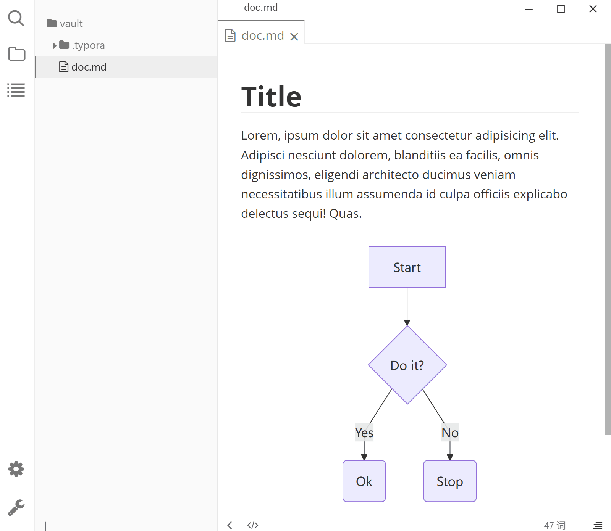

# Codeblock Previewer Plus

English · [简体中文](README.zh-CN.md)

Provides a floating window viewer for code block render previews in [Typora](https://typora.io), with zoom and drag support.

## Features

- **Floating Preview** — Displays an "Open Floating Window" button on rendered Mermaid code blocks; click to view in a new floating window
- **Zoom Controls** — Toolbar at the bottom-right of the floating window provides zoom in/out/reset buttons, with mouse wheel zoom support (range 10% - 500%)
- **Drag to Pan** — Hold left mouse button and drag inside the floating window to pan content
- **Resizable Window** — The floating window supports drag-to-resize

## Preview



## Usage

1. Write a Mermaid code block in your Typora document, for example:

   ````markdown
   ```mermaid
   graph TD
       A --> B
       B --> C
   ```
   ````

2. Typora will render the preview below the code block, with an "Open Floating Window" button (external link icon) in the top-right corner
3. Click the button to view the rendered diagram in a standalone floating window, with zoom and drag support

## Supported Languages

| Language  | Description                |
| --------- | -------------------------- |
| `mermaid` | Mermaid flowcharts/diagrams |

## Installation

1. Install [typora-community-plugin][core]
2. Open "Settings -> Community Plugins", search for "Codeblock Previewer Plus" and install.

## License

MIT

[core]: https://github.com/typora-community-plugin/typora-community-plugin
